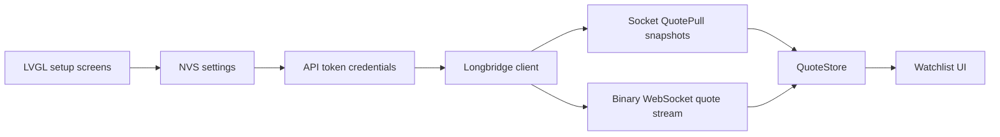

# Architecture Notes

## Direct Device Connection

The terminal is designed to connect directly from Tab5 to Longbridge for market data. There is no quote relay service in v1. This keeps the runtime model simple for personal hardware use and avoids introducing a second service that could see or transform quote data.

## Why Not Port The Desktop SDK

Longbridge publishes desktop/server SDKs, including C/C++ implementations, but those SDKs are not assumed to be ESP32-P4 ready. The firmware keeps a smaller embedded boundary instead:

- API token socket-token calls are implemented with ESP-IDF HTTP client APIs.
- Snapshot pull and quote streaming are implemented with ESP-IDF WebSocket client APIs.
- Device settings are stored in NVS.
- UI state consumes stable local types from `components/quotes`.
- Binary socket/protobuf logic is isolated under `components/longbridge` so quote payload handling can evolve without rewriting UI or quote-store logic.

This avoids binding the firmware to desktop assumptions such as dynamic allocation patterns, transport stacks, filesystem use, or TLS configuration that may not map cleanly to Tab5.

## Data Flow

## Runtime Boundaries

- `components/settings`: persistence only; no network.
- `components/auth`: SHA-256 primitives used by API token signing.
- `components/longbridge`: endpoint selection, API token signing, socket-token calls, WebSocket transport, protocol framing, quote payload codec, retry primitives.
- `components/quotes`: symbol normalization, watchlist, quote merge and stale logic.
- `components/ui`: LVGL rendering and user-intent callbacks.
- `main`: orchestration, Wi-Fi startup/reconnect, snapshot refresh, stream subscription/reconnect, queued push-delta application.

## Known Gap

The Longbridge v1 frame boundary, quote protobuf payload codec, WebSocket AUTH, `QuotePull`, subscribe, unsubscribe, response handling, and sparse quote-push merge path are implemented. Tab5 boot, PSRAM, display landscape rotation, and USB HID keyboard startup have been validated on hardware. The remaining gap is account-level quote validation: API token permissions, AUTH protobuf field assumptions, socket business-error payloads, market-permission responses, HK push restrictions, and reconnect behavior need to be captured against a real Longbridge account on Tab5.
